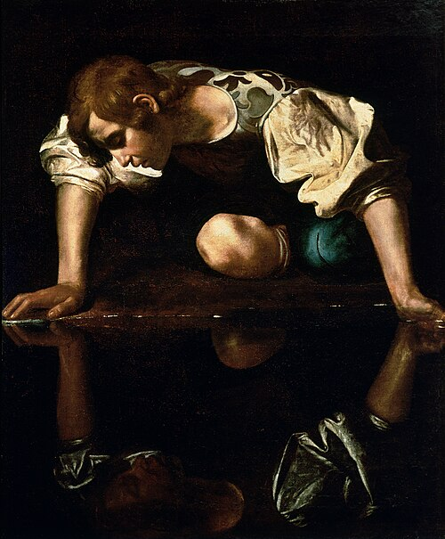

+++
title = 'Reflections on The Picture of Dorian Gray by Oscar Wilde'
date = 2026-04-03T23:41:40+01:00
group = "books"
thumbnail = "./narcissus.png"
+++

<figure style="text-align: center;">

<figcaption style="margin-top: 0;">
    <a href="https://en.wikipedia.org/wiki/Narcissus_%28Caravaggio%29">
    Narciso by Caravaggio
    </a>
</figcaption>
</figure>

 

> ℹ️ this article contains soft spoilers

## Intro
This book is about a person with impeccable looks who accidentally finds a way to keep them forever. However, his selfishness, hedonism, and aestheticism completely corrupt his soul. 

## What drew me in

About the author Oscar Wilde, I didn't know much, except that he was sharp, witty, and jailed for two years for gross indecency. After finding out the book was quoted during the trial against Oscar Wilde, I became really interested and decided to pick it up. What also intrigued me was the numerous variations of book covers that all depict a man contrasted with a grotesque portrait of himself. The covers of the book completely spoiled the ending, which surprisingly didn't bother me.

The first few pages deceive you into thinking the primary plot will be a sort of romance between the protagonist Dorian Grey and painter Basil Hallward. This narrative was completely shattered by the appearance of an aristocratic Lord Henry Wotton, or, more precisely, a conversation between him and Dorian Grey. During their conversation, it's immediately obvious that Dorian Grey is beautiful and empty-headed. With his pretentious, novel and snobby remarks, Lord Henry Wotton plants mental seeds that alter the course of Dorian's life by filling his head with ideas he never could have imagined. I was taken away by just how malleable the main character was, but I also felt deep satisfaction immediately upon realizing the true plot setup was revealed. It transformed the reading experience into trying to interpolate what happens between the opening setup and the image on the cover.

## On beauty
This book places importance on beauty heavily. There are numerous research papers showing that attractive people are perceived as kinder, more successful, and intelligent [dion1972]. In my experience, this is true, but only if the person has interesting traits that make their foundation solid. I often joke with my friends that the most attractive people are not the prettiest ones, but the gritty, imperfect, hot people with an edge. There's something repulsive about the 'perfect' beauty when it's accompanied by nothing else at all. This book implies the opposite: "Beauty is a form of Genius — is higher, indeed, than Genius, as it needs no explanation".

## Dorian Grey
Although Dorian's rocky way towards corruption was obvious, I expected an intellectual uprising on his part. One would imagine that cherishing sublime interests would produce experience, wisdom, and an evolved way of thinking. However, throughout the book, Dorian's mindset remained sheepish, the same sheepish kind when his thoughts were a mere meadow at the beginning of the book. After conversing with Sibyl Vane he decided never to see her again. Then, he changed his mind by determining he wants to marry her. This complete shift in his mindset happened within just a few hours, without any event occurring that would have affected his line of thinking. Later in the book, another naive determination to simply "be good", after living in indecency for over three decades without any repentance, was especially shocking to me. He gave me the impression that he understood himself better, but the smokescreen blows away each time he does something naive. It is hard to root for someone who refuses to learn from his own mistakes. On the other hand, I understand his actions regarding Bails' painting and find it difficult to believe that many of us would have acted differently in his position.

## Lord Henry Wotton
The complete contrast in that regard was Lord Henry Wotton. A captivating figure at the start, but completely indigestible once I finished the book, even though he didn't change whatsoever. To me, he is a figure that represents what troubles Oscar Wilde in the Victorian society he lived in.

Lord Henry Wotton oozes with unconventional, piercing, and snappy aphorisms. Although I didn't explicitly check this, in my opinion, they reflect some of Wilde's own vision and guiding principles. Lord Henry Wotton's ideas are captivating at first. They question ideas of pleasure, interpreting beauty as the highest form of intellectual observation, giving emphasis on one's current joys instead of banking moments for the future, or ruminating on the past. However, at some point, he started degrading the kind of people who are the opposite of him. People who settle down, enjoy recurring social events, and stay consistent with their interests. This became quite annoying. It came off as smug, pretentious, and outright unbearable towards the end. His hedonistic outlook on life was hard to take seriously as it was presented as the only way to satisfaction or purpose in life. Obviously, that's incorrect. There are many types of life purposes that are considered valuable by many of us, and hedonism may or may not be one of them. His inability to understand others was what cost him my respect. His one-dimensionality was magnetizing, but became repelling once the magnetic pole switched in the middle of the book. I think this issue would be solved if Lord Henry Wotton appeared less often in the book.  

## Quotes from Lord Henry Wotton

(1)
> "You will always be fond of me. I represent to you all the sins you never had the courage to commit."

(2)
> "When one is in love, one always begins by deceiving one's self, and one always ends by deceiving others. That is what the world calls a romance."

(3)
> "The books that the world calls immoral are books that show the world its own shame."

(4)
> "The only artists I have ever known who are personally delightful are bad artists. Good artists exist simply in what they make, and consequently are perfectly uninteresting in what they are. A great poet, a really great poet, is the most unpoetical of all creatures. But inferior poets are absolutely fascinating. The worse their rhymes are, the more picturesque they look. The mere fact of having published a book of second-rate sonnets makes a man quite irresistible. He lives the poetry that he cannot write. The others write the poetry that they dare not realize."

(5)
> "Beauty is a form of Genius--is higher, indeed, than Genius, as it needs no explanation. It is one of the great facts of the world, like sunlight, or springtime, or the reflection in the dark waters of that silver shell we call the moon. It cannot be questioned. It has the divine right of sovereignty. It makes princes of those who have it."

(6)
> "When I like people immensely, I never tell their names to anyone. It is like surrendering a part of them. I have grown to love secrecy. It seems to be the one thing that can make modern life mysterious or marvelous to us. The commonest thing is delightful if one only hides it. When I leave town now I never tell my people where I am going. If I did, I would lose all my pleasure. It is a silly habit, I dare say, but somehow it seems to bring a great deal of romance into one's life.

## Verdict
Read this book if:
- you are intrigued by snobby/smart remarks
- you are a looksmaxxer and it's destroying your life
- you like hedonism, self-conflict, aesthetics, romantic tensions

Don't read this book if:
- you like plot driven books
- you are prejudiced against certain people
- you don't like pretentious characters
- you don't like when the obvious happens

 
 

grade: 4/10

 

## References

[dion1972] https://psycnet.apa.org/record/1973-09160-001
